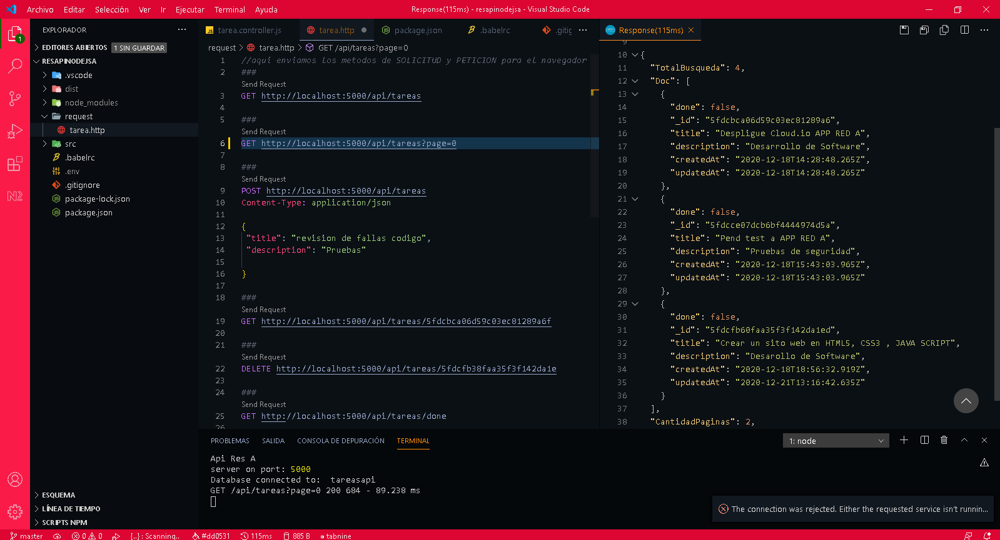

# resapi-tareas
Res api nodejs y varios modulos para poder agregar , consultar , consulta especifica, eliminar y actualizar campos en un objeto de base de datos MongoDB

 

Instalar modulos npm i

babel, express,morganm ejs, corse, mongoose,dotenv
